# The intense adding of a new object in a new tab
### Now a full document on how to do it, from scratch!

I want to note that, you should read this from the **VSCode markdown preview**, it includes images.

Also i need to note that i will use `IDA Pro` for this since i really don't know how to use `Ghidra` that well.
However, it is possible to do it on Ghidra too.

Also, any question please let me know!

# 1. Loading the binaries
We need to load the binaries in IDA Pro to analyze them, since android has symbols and windows doesn't we need to load both of them.

# 2. Finding the function
Our goal here is to add a new object to the editor but how do we even start searching for it?

My approach was to first try and see what was the class of the added objects in the editor, we can do this using **DevTools!**

Here is what i got while searching:
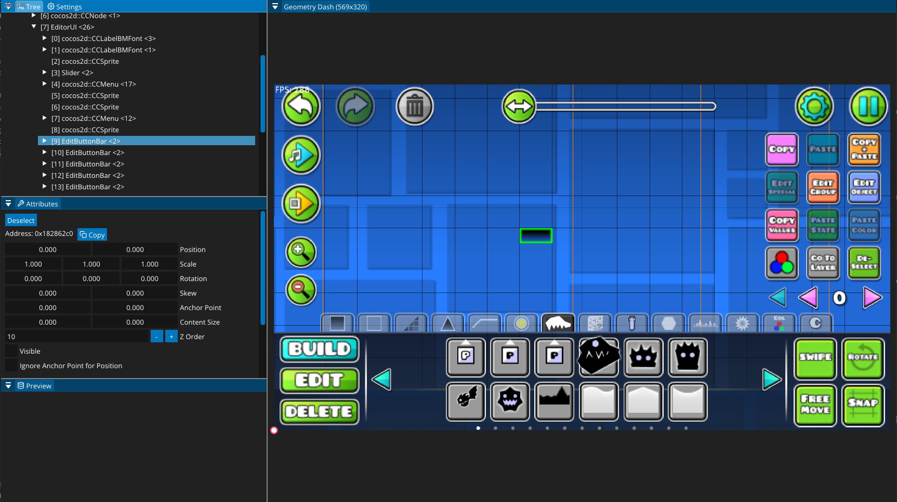

`EditButtonBar` is probably what we are searching for.
The devtools show there is around 15 of them which matches with the number of tabs the editor has for objects. Jackpot!

# 3. EditButtonBar reverse engineering
We now need to search `EditButtonBar` in the **Android binary** (since it has symbols) and see what it does.

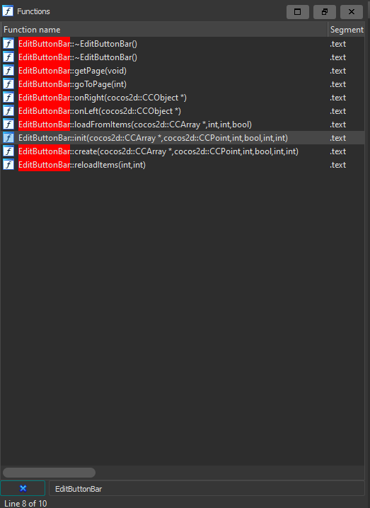

There is multiple methods here but we are interested in the `EditButtonBar::init` 
> (I could probably have used `EditButtonBar::reloadItems` but it's easier to use the init for just adding already existing items)


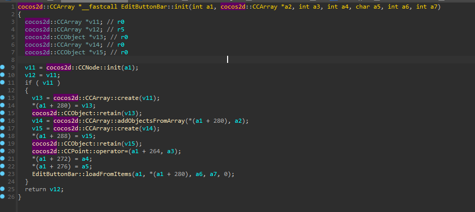

Something something load from items. We can tell by logic this is what loads the ingame items. To confirm this, let's search the **xrefs** of the function!

> Right Click - Jump to xref

> (Or just press x)

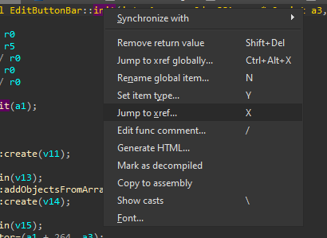

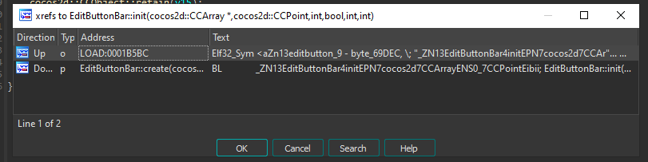

Wha- There is only the create! (ignoring the elf (first element) stuff thats android only and is never used)

Of course, init must ONLY be called by a create! **This is a rule for cocos2dx, the init will always only be called by the create!**

*(Or almost always, there might be some rebel classes that don't do this... but most do)*

We already know how to see xrefs, we will now double click the reference to `EditButtonbar::create` and check the xrefs to `EditButtonbar::create`.

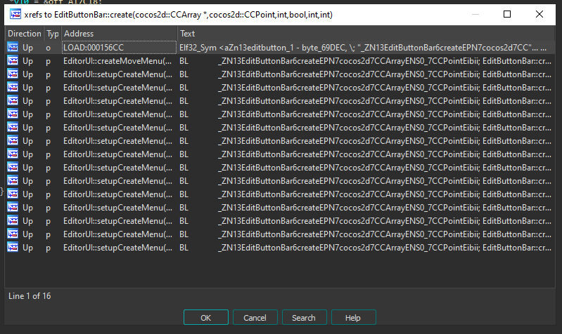

**Bingo!**

There seems to be two functions `EditorUI::createMoveMenu(void)` and `EditorUI::setupCreateMenu(void)`.

I think it's pretty obvious which one we choose, however if you are not sure, count how many calls are done from `EditorUI::setupCreateMenu(void)` to our function! It matches the number of tabs there are.

# 1.3 The reversing of setupCreateMenu
> *Reminder that we are still in the android binary*

It will take quite a while to decompile this function so uh go grab a cup of tea meanwhile.

After the decompilation, we will be greeted with this:

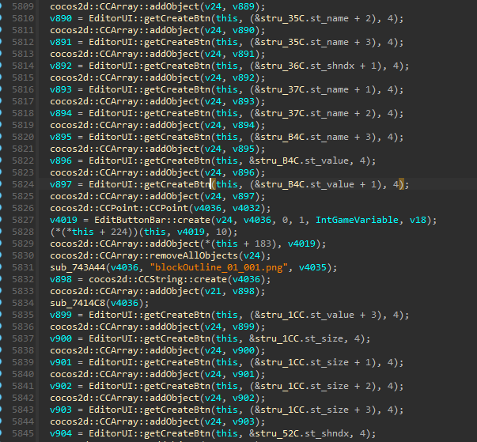

Oh that's def how robtop adds objects, it's all hardcoded robtop style.

By just this image, we can tell some stuff.

- Objects in the tab are created with the `EditorUI::getCreateBtn` function. It does some weird `stru_number` thing? and also passes a 4 as an argument
- Then, this created object is added to a CCArray `v24`
- After finishing adding all the needed objects, it calls `EditButtonBar::create` with `v24` first and some other values
- We now can tell that `v24` holds all the objects for certain tab
- After that it adds the created tab to `this + 224` which is a member of `EditorUI`
- Then proceeds to clean `v24`
- Creates a CCString with the object that is shown in the tab selection button
- Adds it to *another different* array, `v21`
- Repeats the whole process

Note,  `sub_743A44(v4036, "blockOutline_01_001.png", v4035);` is the same as the next c++ code: 
```c++
std::string v4036 = std::string("blockOutline_01_001.png");
```
With `v4036` being the variable that stores the string and `v4035` just a leftover (bad decompilation)

`sub_7414C8(v4036)` is a destructor, destroys `v4036` since it will no longer be used

You will learn this things with time really, there isn't a good way to tell when certain stuff is from the standard library, only by either guessing or reversing something you have wrote yourself and you know what it is and learn from it.

# 1.4 Profund analysis.
We are missing some key stuff here, we already know how it creates the object and adds it to the tabs. It will also add it ingame somewhere late in the function but that's done for us, we really don't have to reverse it.

Now, what in the world is `&stru_number`? 

As it turns out, is faulty decompilation. Here is where knowing assembly is necessary.

Compare the assembly with the decompiled code:

Assembly:
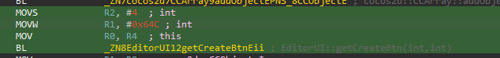
Decompiled:

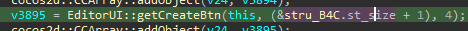

There is something wrong right, where the hell is the struct?

We can pretty much by logic tell that the struct is meant to be the `0x64C` that is shown in the assembly

We can corroborate this by going to the first object that is added
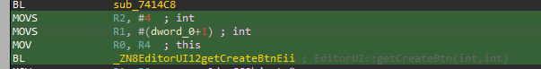

We can press `Q` in the `dword_0` to convert it into a number, we will get:
```x86asm
MOVS            R2, #4  ; int
MOVS            R1, #1  ; int
MOV             R0, R4  ; this
BL              _ZN8EditorUI12getCreateBtnEii ; EditorUI::getCreateBtn(int,int)
```

So yeah! We can now tell that the `R1, #1` is the **Object ID**. We will use this for our hooking!

# 1.5 Reversing conclusion with brainstorming

We know that `EditorUI::setupCreateMenu` adds all the tabs and `EditorUI::getCreateBtn` is used to add an object.

`EditorUI::getCreateBtn` has 2 ints as arguments, one is for the object ID and the other one we don't know but it's almost always 4.

We also know that `EditButtonBar::create` is used to create a tab with the objects!

So we hook `EditorUI::setupCreateMenu` and add our own object right?

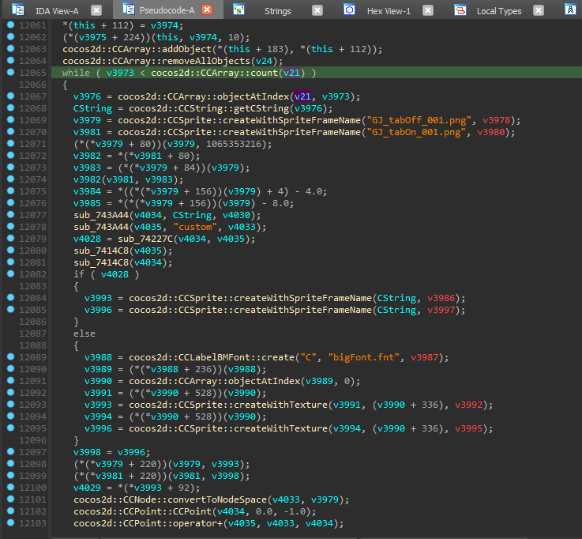

As it turns out. At the end of `EditorUI::setupCreateMenu` it checks `v21`, iterates throught it and then creates the tabs!

This is bad! We can't add our own object now because objects were already added! (Or if we were to hook the start, we can't add them since the tabs arent created yet!)

What do we do????

Let's think a bit, we figured out `EditButtonBar::create` needs a `CCArray*` with our objects. If we want to add an object, why don't we just hook it add modify the array to add ours?

**Bingo!** We can do that, by modifying the function array we can add our own object! Let's do that!

# 2. Writing the mod

We now have to do actual coding #scary

Let's hook `EditButtonBar::create` and add our own object!

```cpp
#include <Geode/Geode.hpp>

#include <Geode/modify/EditButtonBar.hpp>

using namespace geode::prelude;

class $modify(EditButtonBar) {
	bool init(cocos2d::CCArray* objects, cocos2d::CCPoint p1, int id, bool p3, int p4, int p5) {
		if (!EditButtonBar::init(objects, p1, id, p3, p4, p5)) return false;

        /*
        We need to recreate this:
          v3968 = EditorUI::getCreateBtn(this, (&stru_BCC.st_name + 1), 4);
          cocos2d::CCArray::addObject(v24, v3968);
        */

        return true;
	};
};
```

> Note, always hook the "init" instead of "create".

Oh uh! We found an issue, we can't call `EditorUI::getCreateBtn` since we are not inside the `EditorUI` class! 

How do we access it?

### We have 2 options.
1. Recreate the entire function
2. Make a hacky thing and save the `EditorUI` pointer to a global variable

Guess which one is easier lol

Let's hook `EditorUI::init`, save the `this` pointer to a global variable and use it!
```cpp
#include <Geode/Geode.hpp>

#include <Geode/modify/EditButtonBar.hpp>
// Remember to add modify include for each class youre modifying!
#include <Geode/modify/EditorUI.hpp>

using namespace geode::prelude;

EditorUI* editorUI = nullptr;

class $modify(EditorUI) {
	bool init(LevelEditorLayer* layer) {
		if (!EditorUI::init(layer)) 
            return false;
	
    	editorUI = this;

        return true;
	}
};

class $modify(EditButtonBar) {
	bool init(cocos2d::CCArray* objects, cocos2d::CCPoint p1, int id, bool p3, int p4, int p5) {
		if (!EditButtonBar::init(objects, p1, id, p3, p4, p5)) return false;
        // No need to access with m_fields since its a global variable.
        auto obj = editorUI->getCreateBtn(1, 4);
        objects->addObject(obj);

        return true;
	};
};
```

Let's go! Now let's compile the mod!

Aw god dammit, we don't have the address of `getCreateBtn` neither we have it's return type.

Let's get them then!

# 2.1 Getting the address
There is a lot of ways to get the address of stuff, I will use 1 method here which will lead us to the answer.

## By string reference!

Let's take a look at the decompilation of `getCreateBtn`

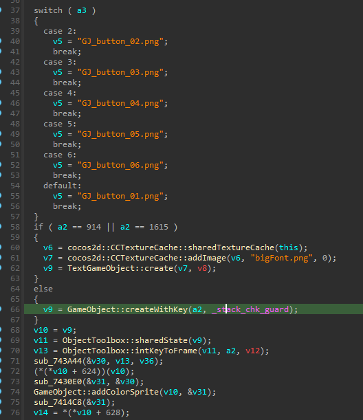

```cpp
  switch ( a3 )
  {
    case 2:
      v5 = "GJ_button_02.png";
      break;
    case 3:
      v5 = "GJ_button_03.png";
      break;
    case 4:
      v5 = "GJ_button_04.png";
      break;
    case 5:
      v5 = "GJ_button_05.png";
      break;
    case 6:
      v5 = "GJ_button_06.png";
      break;
    default:
      v5 = "GJ_button_01.png";
      break;
  }
```

This one is of our interest.

*Also with this we can tell what the other int is for, it's for the background of the object!*

## Let's go to the `Windows Binary`

With IDA Pro we can press `shift + f12` to open the strings tab.

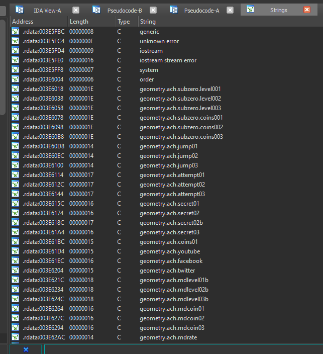

Let's search up any of the "GJ_Buttons" !

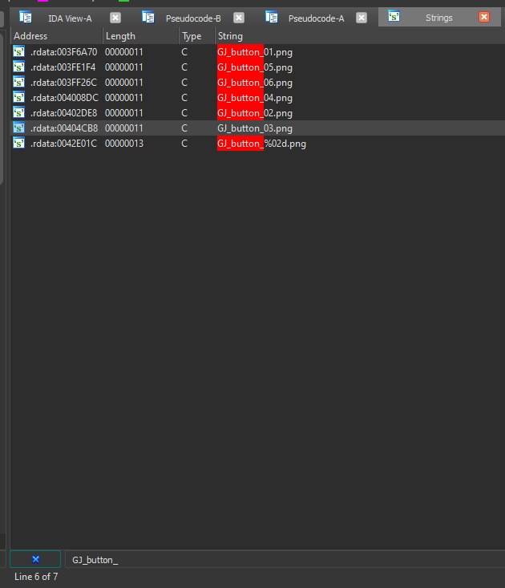

We need to think a bit. We are doing this to search functions that use *THAT* string. Since this are quite a common sprites, there will be multiple functions that show this sprite. Let's just make our lifes easier and choose the one that has the less references.  

To search that, we double click any of them, i will select `"GJ_button_06.png"`

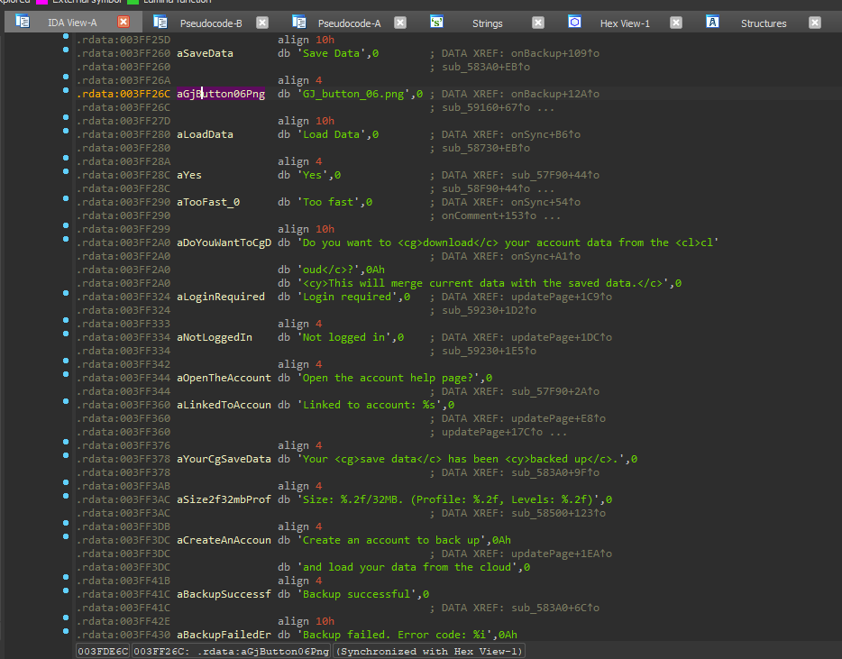


We now search for the `xrefs`! if you don't remember how to search for xrefs look up!

We will put our mouse in front of the `aGjButton06Png` since that's the declaration.

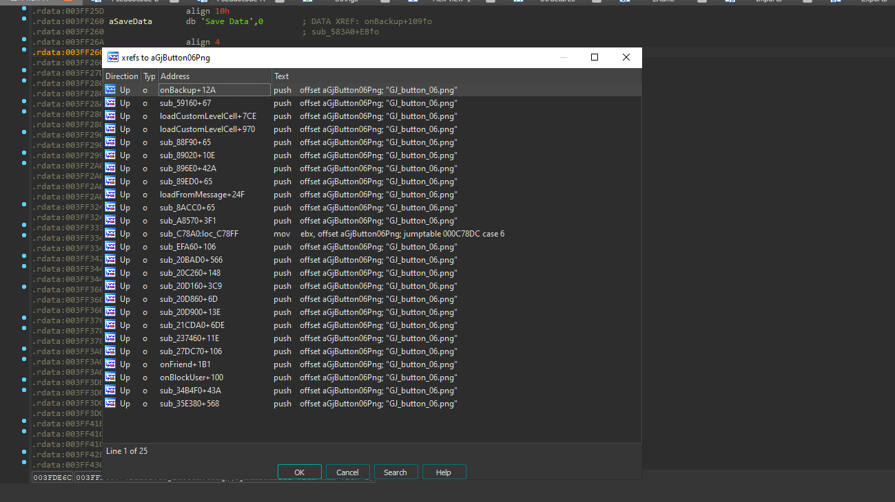

Holy molly, we have quite a lot of xrefs.
> ptsss: we can tell it's the one with the Switch Case thing since our decompilation shows switch cases but let's think it doesnt exist for now

Let's repeat this process with all the GJ's until we find the one with less xrefs, this is to make our life easier after...

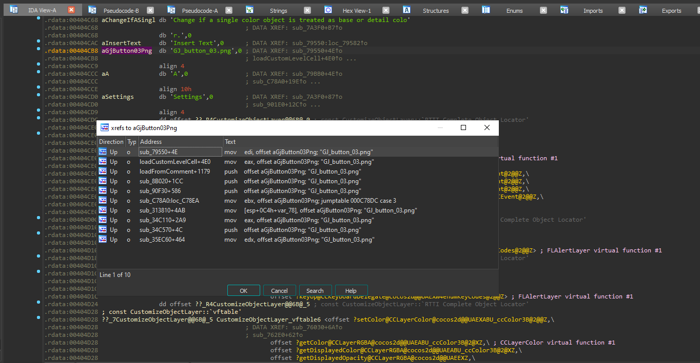

Aha! This one has a low amount.

We now have to. Go throught all of them. And search the one that matches our decompiled switch case.

Here is a video of me doing this:


After we found it we can go on top of the function to get the address!

## Please rebase your IDA First.
You can rebase your IDA by going:

`Edit > Segments > Rebase program`

Rebase it to `0x0` so we don't have to do extra math to get the offsets.

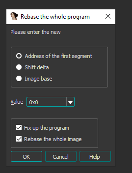

Wait for it to rebase, shouldn't take that long.

**Note: we are still in the windows binary**

## Back to the address

We can see the address of our function as the name of the decompilation!

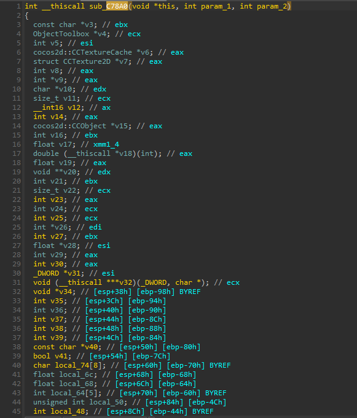

`0xC78A0` it is! Let's add it to our bindings!

# 2.3 Adding to bindings! And... the return type

Let's just search the name of the function `getCreateBtn` in the `GeometryDash.bro` file

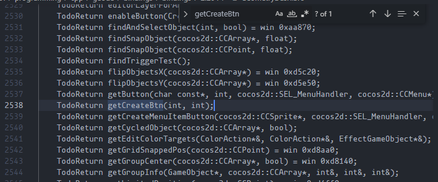

We can just set it to 
```cpp
TodoReturn getCreateBtn(int, int) = win 0xC78A0;
```

However, what about the return? We know it returns something because it's a "Create" and is used to add to the CCArray.

## Let's get back to the `Android Binary`

### We are at `EditorUI::getCreateBtn`

Let's look all the way down our decompilation since the return variable is always down.

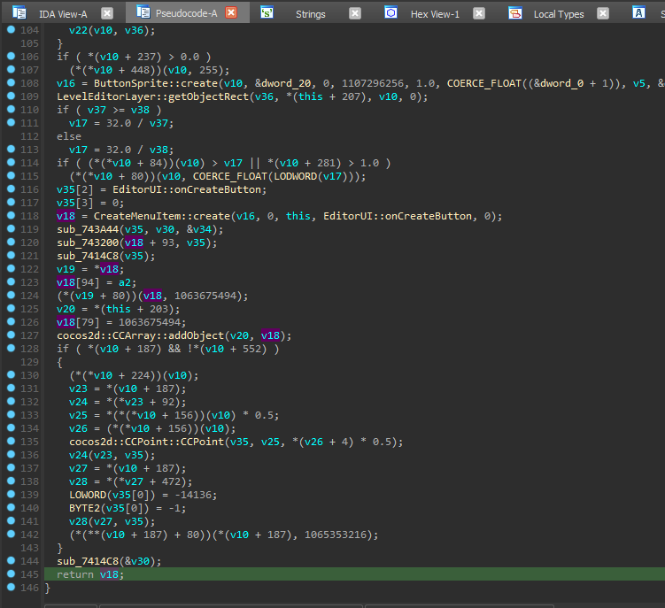


Oh, it returns `v18`.
We need to backtrack what `v18` is!

In this case, it's easy to tell since at the top of the image we can see `  v18 = CreateMenuItem::create(v16, 0, this, EditorUI::onCreateButton, 0);`

**It's now safe to asume that the return type is a `CreateMenuItem*`!**

Note, it's a pointer because it uses `CreateMenuItem::create`. Creates mostly always return pointers!

Let's edit our broma with the return type.

```cpp
CreateMenuItem* getCreateBtn(int, int) = win 0xC78A0;
```

There we go! We can now use it in our code!

# 3. The actual mod code lol

We ended up with this code:

```cpp
#include <Geode/Geode.hpp>

#include <Geode/modify/EditButtonBar.hpp>
#include <Geode/modify/EditorUI.hpp>

using namespace geode::prelude;

EditorUI* editorUI = nullptr;

class $modify(EditorUI) {
	bool init(LevelEditorLayer* layer) {
		if (!EditorUI::init(layer)) 
            return false;
	
    	editorUI = this;

        return true;
	}
};

class $modify(EditButtonBar) {
	bool init(cocos2d::CCArray* objects, cocos2d::CCPoint p1, int id, bool p3, int p4, int p5) {
		if (!EditButtonBar::init(objects, p1, id, p3, p4, p5)) return false;
        // No need to access with m_fields since its a global variable.
        auto obj = editorUI->getCreateBtn(1, 4);
        objects->addObject(obj);

        return true;
	};
};
```

This will indeed compile, however, **it will add the object ID 1** to ALL the tabs since everytime a tab is created, the `EditButtonBar::init` is called.

If we look back at our decompilation (android) we can tell something
```cpp
  // ...
  v4024 = EditButtonBar::create(v24, v4036, 9, 1, IntGameVariable, v18);
  // ...
  v4026 = EditButtonBar::create(v24, v4036, 10, 1, IntGameVariable, v18);
  // ... more code ...
  v3842 = EditButtonBar::create(v24, v4036, 11, 1, IntGameVariable, v18);
```

The `3rd` argument of `EditButtonBar::create` is always incrementing by 1!

That probably means that the 3rd argument is `The ID of the tab`! (There was no reason to add that, but robtop did lol thanks robtop)

We can now make an if to check which one

```cpp
#include <Geode/Geode.hpp>

#include <Geode/modify/EditButtonBar.hpp>
#include <Geode/modify/EditorUI.hpp>

using namespace geode::prelude;

EditorUI* editorUI = nullptr;

class $modify(EditorUI) {
	bool init(LevelEditorLayer* layer) {
		if (!EditorUI::init(layer)) 
            return false;
	
    	editorUI = this;

        return true;
	}
};

class $modify(EditButtonBar) {
	bool init(cocos2d::CCArray* objects, cocos2d::CCPoint p1, int id, bool p3, int p4, int p5) {
		if (!EditButtonBar::init(objects, p1, id, p3, p4, p5)) return false;
        // Note: IDs start from 0
        if (id == 1)
        { 
            // No need to access with m_fields since its a global variable.
            auto obj = editorUI->getCreateBtn(1, 4);
            objects->addObject(obj);
        }

        return true;
	};
};
```

And that's it! We finished!!!... Didn't we?


As it turns out, `editorUI` will always be nullptr, why in the world...?

Let's check how the calls are done for our code.
```
    EditorUI::init
        EditButtonBar::init
            -> OurEditorBarCode::init
    -> OurEditorUICode::init
``` 
*oh*

We need to set the this pointer before the `EditorUI::init` and we need to add our object before the `EditButtonBar::init`.

Well that's easy, needs to be like this:
```
    -> OurEditorUICode::init
        EditorUI::init
            -> OurEditorBarCode::init
                    EditButtonBar::init
``` 

Let's pass that into our cpp code!

```cpp
#include <Geode/Geode.hpp>

#include <Geode/modify/EditButtonBar.hpp>
#include <Geode/modify/EditorUI.hpp>

using namespace geode::prelude;

EditorUI* editorUI = nullptr;

class $modify(EditorUI) {
	bool init(LevelEditorLayer* layer) {
    	editorUI = this;

		if (!EditorUI::init(layer)) 
            return false;
        return true;
	}
};

class $modify(EditButtonBar) {
	bool init(cocos2d::CCArray* objects, cocos2d::CCPoint p1, int id, bool p3, int p4, int p5) {
        // Note: IDs start from 0
        if (id == 1)
        { 
            // No need to access with m_fields since its a global variable.
            auto obj = editorUI->getCreateBtn(1, 4);
            objects->addObject(obj);
        }

		if (!EditButtonBar::init(objects, p1, id, p3, p4, p5)) return false;
        return true;
	};
};
```

We can simplify this.

```cpp
#include <Geode/Geode.hpp>

#include <Geode/modify/EditButtonBar.hpp>
#include <Geode/modify/EditorUI.hpp>

using namespace geode::prelude;

EditorUI* editorUI = nullptr;

class $modify(EditorUI) {
	bool init(LevelEditorLayer* layer) {
    	editorUI = this;

		return EditorUI::init(layer);
	}
};

class $modify(EditButtonBar) {
	bool init(cocos2d::CCArray* objects, cocos2d::CCPoint p1, int id, bool p3, int p4, int p5) {
        // Note: IDs start from 0
        if (id == 1)
        { 
            // No need to access with m_fields since its a global variable.
            auto obj = editorUI->getCreateBtn(1, 4);
            objects->addObject(obj);
        }

		return EditButtonBar::init(objects, p1, id, p3, p4, p5);
	};
};
```

For your use case, someone made a level named Object IDs with all object ids :wink:

Change the ID to the one you want!

## And that's it! Thank you for reading this tutorial. I really liked doing this and hope you enjoyed. Please tell me anything or ask me anything as i said in the start! Thank you for everything!